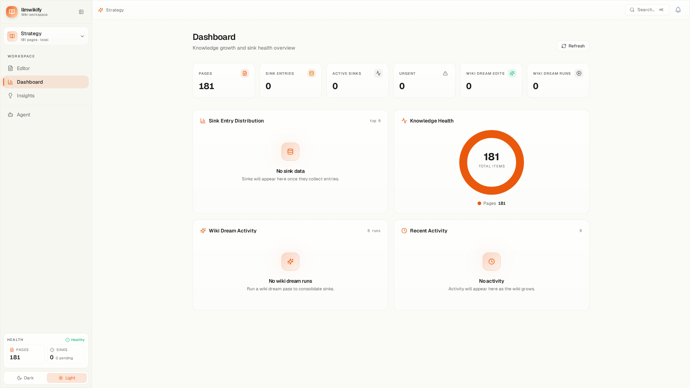
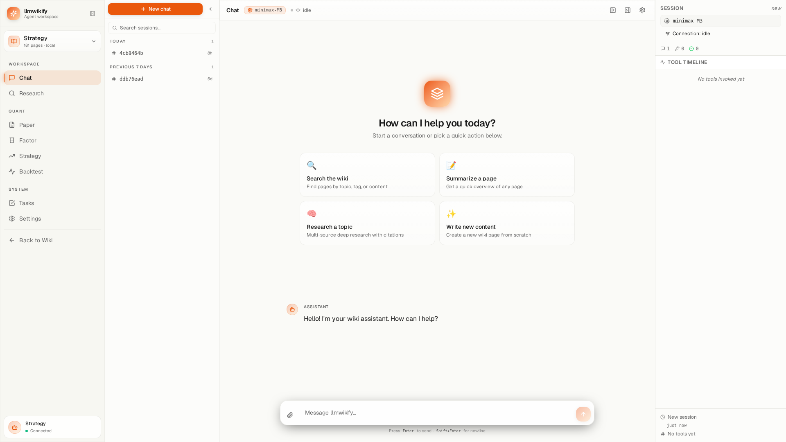
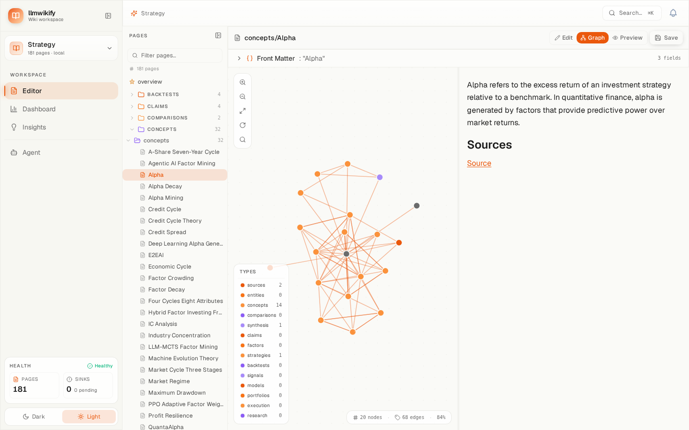
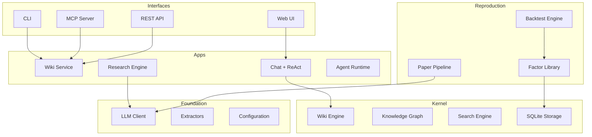

# llmwikify

> **Build persistent, LLM-maintained knowledge bases — and reproduce quant research from papers.**

[](https://pypi.org/project/llmwikify/)
[](https://www.python.org/downloads/)
[](https://opensource.org/licenses/MIT)
[](https://github.com/sn0wfree/llmwikify)
[](pyproject.toml)

**llmwikify** is a Python CLI + library + unified server for building **persistent,
LLM-maintained knowledge bases** with a dedicated **quant research reproduction pipeline**.



> ⚠️ **Beta Release** — APIs may shift between minor versions. Report issues on
> [GitHub](https://github.com/sn0wfree/llmwikify/issues).

---

## Why llmwikify?

| | |
|---|---|
| 🔍 **Smart Search** | SQLite FTS5 + optional QMD hybrid (BM25 + vector + LLM reranking) |
| 🔗 **Bidirectional Links** | Automatic `[[wikilink]]` detection with section-level granularity |
| 🧠 **Knowledge Graph** | 8 relation types, PageRank, community detection, interactive D3.js visualization |
| 🤖 **ReAct Agent** | Streaming chat with tool calling, confirmations, and 26 MCP tools |
| 📊 **Quant Pipeline** | Paper → 6-layer Factor YAML → DuckDB → Backtest → L5 reflection |
| 🌐 **Unified Server** | MCP + REST + WebSocket + Web UI in one process |

---

## Features

### Chat + ReAct Agent ⚠️ Under Active Development
Streaming chat with tool calling, confirmations, and 26 MCP tools. The agent can search your wiki, analyze sources, and generate insights — all with human-in-the-loop confirmations.

> ⚠️ **Note:** This feature is under active development and may be unstable.



### Markdown Editor
Split-pane live markdown editor with page tree, front-matter panel, and wikilink autocomplete. Edit, preview, and manage your wiki pages in one view.


### Knowledge Graph
Interactive D3.js force-directed graph with PageRank node sizing, community coloring, and bridge highlighting. Explore relationships between your wiki pages visually.



### Dashboard
Track your knowledge growth with metrics cards, Wiki Dream activity timeline, and health indicators. See how your wiki evolves over time.


---

## Quick Start

```bash
# Install
pip install llmwikify

# Initialize a wiki
llmwikify init
cd my-wiki

# Ingest a source
llmwikify ingest document.pdf

# Start the server (MCP + REST + Web UI)
llmwikify serve --web --port 8765
# Open http://localhost:8765
```

---

## Tutorial

New to llmwikify? Start with our **5 end-to-end scenarios**:

| # | Scenario | Description |
|---|----------|-------------|
| 1 | Personal Reading Notes | PDF → searchable wiki with cross-references |
| 2 | Company Due-Diligence KB | Multi-source analysis → knowledge graph |
| 3 | Multi-Wiki Collaboration | Manage multiple wikis through one server |
| 4 | Chat + ReAct Agent | LLM-powered Q&A with tool calling |
| 5 | Quant Reproduction | Paper → Factor → Backtest → L5 reflection |

📖 **Full tutorial**: [`docs/TUTORIAL.md`](docs/TUTORIAL.md) (40-60 min read)
🎯 **Runnable examples**: [`examples/`](examples/README.md) (8 playbooks, no LLM required)

---

## Features at a Glance

| Feature | Description |
|---------|-------------|
| **Wiki Core** | FTS5 search, bidirectional references, query compounding, multi-wiki registry |
| **Smart Lint** | Broken links, orphans, contradictions, outdated pages, knowledge gaps |
| **Knowledge Graph** | 8 relation types, PageRank, community detection, HTML/SVG/GraphML export |
| **Chat + Agent** | ReAct streaming, 26 MCP tools, skills system, research engine |
| **Quant Reproduction** | Paper extraction, 6-layer factors, DuckDB, backtesting, L5 reflection |
| **Web UI** | React SPA: editor, graph, dashboard, chat, quant pages |
| **Extraction** | PDF, Word, Excel, PowerPoint, images, audio, web, YouTube |
| **MCP Server** | 26 tools over stdio + HTTP, multi-wiki support |

---

## Architecture



---

## Installation

```bash
pip install llmwikify              # Core (zero hard deps)
pip install llmwikify[all]         # Full features
pip install llmwikify[web]         # Web UI + REST
pip install llmwikify[mcp]         # MCP server
pip install llmwikify[extractors]  # PDF/Office/media
```

### Optional Extras

| Extra | Purpose |
|-------|---------|
| `extractors` | PDF / Office / images / audio / YouTube via MarkItDown |
| `mcp` | MCP server (`fastmcp`) |
| `watch` | Filesystem watching (`watchdog`) |
| `graph` | Graph visualization + community detection |
| `web` | FastAPI / Starlette / Uvicorn for the unified server |
| `agent` | Scheduler + filelock + DuckDuckGo / Tavily search |
| `llm` | `tiktoken` for token counting |
| `all` | Everything above |

---

## CLI Reference

| Command | Description |
|---------|-------------|
| `init` | Initialize a wiki |
| `ingest` | Ingest a source file or URL |
| `batch` | Batch ingest a directory |
| `search` | Full-text search |
| `references` | Show inbound/outbound links |
| `lint` | Health check |
| `graph-analyze` | PageRank, communities, suggestions |
| `export-graph` | Export visualization (HTML/SVG/GraphML) |
| `synthesize` | Save query answer as a wiki page |
| `serve` | Start unified server (MCP + REST + Web UI) |
| `quant-init` | Scaffold quant/ directory |
| `wiki_*` | 26 MCP tools for LLM integration |

---

## Python API

```python
from llmwikify import create_wiki

# Create or open a wiki
wiki = create_wiki("./my-wiki")

# Write a page
wiki.write_page("Python/Singleton", "# Singleton Pattern\nEnsures one instance...")

# Read a page
content = wiki.read_page("Python/Singleton")

# Search
results = wiki.search("singleton", limit=10)

# Inbound/outbound links
inbound = wiki.get_inbound_links("Python/Singleton")
outbound = wiki.get_outbound_links("Python/Singleton")

# Status / lint
status = wiki.status()
lint_result = wiki.lint()

wiki.close()
```

### Run the unified server programmatically

```python
from llmwikify import Wiki
from llmwikify.interfaces.server import WikiServer

wiki = Wiki("./my-wiki")
server = WikiServer(
    wiki,
    api_key="optional-secret",
    enable_mcp=True,
    enable_rest=True,
    enable_webui=True,
)
server.run(host="0.0.0.0", port=8765)
```

---

## MCP Server (26 Tools)

Wiki maintenance and query:

| Tool | Description |
|------|-------------|
| `wiki_init` | Initialize wiki structure |
| `wiki_ingest` | Ingest a source file |
| `wiki_write_page` | Write/update a wiki page |
| `wiki_read_page` | Read a wiki page |
| `wiki_search` | Full-text search (FTS5) |
| `wiki_lint` | Health check |
| `wiki_status` | Status overview |
| `wiki_references` | Page references |
| `wiki_synthesize` | Save query answer as wiki page |
| `wiki_graph` | Graph query / modify |
| `wiki_graph_analyze` | Graph export / detect / report |

Multi-wiki management:

| Tool | Description |
|------|-------------|
| `wiki_list` | List all registered wikis |
| `wiki_switch` | Switch to a different wiki |
| `wiki_register` | Register a new wiki |
| `wiki_search_cross` | Search across multiple wikis |
| `wiki_scan` | Scan directories for wikis |

---

## Documentation

- [`docs/TUTORIAL.md`](docs/TUTORIAL.md) — **5 end-to-end scenarios (must read)**
- [`examples/`](examples/README.md) — 8 runnable playbooks
- [`ARCHITECTURE.md`](ARCHITECTURE.md) — Layered architecture, modules, data flow
- [`docs/CONFIGURATION_GUIDE.md`](docs/CONFIGURATION_GUIDE.md) — All config options
- [`CONTRIBUTING.md`](CONTRIBUTING.md) — Development setup and workflow

---

## Contributing

Contributions welcome! See [CONTRIBUTING.md](CONTRIBUTING.md) for development
setup, coding standards, and the contribution workflow.

---

## Acknowledgments

- **[llm-wiki-kit](https://github.com/iamsashank09/llm-wiki-kit)** — Original inspiration
- **Andrej Karpathy** — [LLM Wiki Principles](docs/LLM_WIKI_PRINCIPLES.md)
- **Obsidian** — Markdown wiki platform
- **MCP** — Model Context Protocol

---

## License

MIT License — see [LICENSE](LICENSE).

## Contact

- **GitHub**: [@sn0wfree](https://github.com/sn0wfree)
- **Email**: linlu1234567@sina.com
- **Discussions**: [GitHub Discussions](https://github.com/sn0wfree/llmwikify/discussions)
