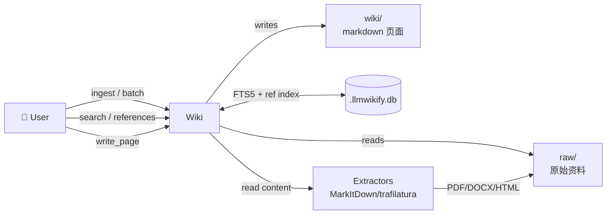

# llmwikify 端到端使用教程

> **版本**：v0.38.0 (2026-06-30) · **目标读者**：首次接触 llmwikify 的
> 开发者 / 研究员。  
> **配套剧本**：[`examples/01_~08_`](../examples/README.md) — 5 个场景 +
> 3 个功能 playbook，每节有对应可跑脚本。  
> **预计阅读时间**：40-60 分钟 / 实操 1-2 小时。

本文按 5 个真实场景展开，每个场景覆盖「背景 → 步骤 → 输出 → 架构图 →
底层产物 → 故障排查」5 个固定段。建议顺序读完，**不要跳读** — 后 4 个
场景会复用前 3 个的产物。Part 3 补充 3 个功能 playbook（lint / yaml 模板 /
章节锚点），可随时查阅。

---

## 目录

- [0. 预备：安装矩阵 + 决策树](#0-预备安装矩阵--决策树)
- [场景 1：个人阅读笔记 wiki](#场景-1个人阅读笔记-wiki)
- [场景 2：公司尽调知识库](#场景-2公司尽调知识库)
- [场景 3：多 wiki 协作](#场景-3多-wiki-协作)
- [场景 4：Chat + ReAct Agent](#场景-4chat--react-agent)
- [场景 5：Quant 复现 (Paper → Factor → Backtest)](#场景-5quant-复现-paper--factor--backtest)
- [Part 3 — 功能 Playbook 索引](#part-3--功能-playbook-索引)
- [附录 A：配置文件优先级速查](#附录-a配置文件优先级速查)
- [附录 B：CLI vs Python API 决策表](#附录-bcli-vs-python-api-决策表)
- [附录 C：MCP 客户端接入示例](#附录-cmcp-客户端接入示例)

---

## 0. 预备：安装矩阵 + 决策树

### 安装矩阵

llmwikify 核心是「**零硬依赖**」（只要求 stdlib + `jinja2` + `pyyaml` +
`requests` + `duckdb`），所有扩展都是可选的。按使用场景选装：

| 场景 | 命令 | 增量 |
|---|---|---|
| 纯 wiki（CLI + FTS5） | `pip install llmwikify` | — |
| + PDF / Office 解析 | `pip install 'llmwikify[extractors]'` | MarkItDown 全套 |
| + MCP 协议 | `pip install 'llmwikify[mcp]'` | fastmcp |
| + Web UI / REST | `pip install 'llmwikify[web]'` | FastAPI + uvicorn + httpx |
| + 文件监听 | `pip install 'llmwikify[watch]'` | watchdog |
| + 知识图谱可视化 | `pip install 'llmwikify[graph]'` | networkx + pyvis + python-louvain |
| + Agent（cron + 搜索） | `pip install 'llmwikify[agent]'` | croniter + duckduckgo-search + tavily |
| + LLM token 计数 | `pip install 'llmwikify[llm]'` | tiktoken |
| + A股数据源 | `pip install 'llmwikify[quantnodes]'` | quantnodes |
| **全套** | `pip install 'llmwikify[all]'` | 上面全部 |

开发模式：

```bash
git clone https://github.com/sn0wfree/llmwikify.git
cd llmwikify
pip install -e ".[dev]"   # 含 all + pytest + ruff + mypy
```

### 决策树

```
我要做什么？
├── 仅本地知识库/笔记
│   └── pip install llmwikify         (FTS5 已够用)
│
├── 想要网页 / Web UI
│   └── pip install 'llmwikify[web]'  (FastAPI + REST)
│
├── 想要 AI Agent 集成（Claude / opencode / Cursor）
│   └── pip install 'llmwikify[mcp]'  + llmwikify serve --transport stdio
│
├── 想要语义检索（>1000 页）
│   └── 装 QMD：npm i -g @tobilu/qmd  +  pip install 'llmwikify[mcp,web]'
│
└── 想要量化复现 pipeline
    └── pip install 'llmwikify[quantnodes,llm,web,mcp]'
```

### 三个全局路径

- **代码**：`from llmwikify import Wiki, create_wiki` — `Wiki` 是入口类（13
  mixin 组合）
- **CLI**：`llmwikify <subcommand>` — 装好包就有的 console 入口
- **配置**：
  - `~/.llmwikify/llmwikify.json`（用户级 LLM + server 默认）
  - `<wiki-root>/.wiki-config.yaml`（每个 wiki 自己的覆盖）

> 优先级：**程序参数 > `.wiki-config.yaml` > 内置默认**（详见 [附录 A](#附录-a配置文件优先级速查)）。

---

## 场景 1：个人阅读笔记 wiki

**目标**：把 3 篇关于 LLM Wiki 设计的 PDF / Markdown 读后笔记串成可搜索
的 wiki。**配套剧本**：[`examples/01_personal_reading_notes/`](../examples/01_personal_reading_notes/README.md)。

### 1.1 背景

你下载了 3 篇 Karpathy/Andrew Ng 的 AI 学习方法 PDF，平时记在 Notion
里。但 Notion 没有 LLM-native 全文检索、双向引用、合成问答沉淀。llmwikify
就是为这种"读完就归档、需要时 LLM 重读"场景设计的。

### 1.2 文件树变化

**Before**：

```
~/notes/
└── pdfs/
    ├── karpathy-llm-wiki.md
    ├── andrew-ng-ai-notes.md
    └── obsidian-vs-llm-wiki.md
```

**After**（llmwikify 处理后）：

```
~/notes/
├── pdfs/                       # 原始资料，原样保留
│   ├── karpathy-llm-wiki.md
│   ├── andrew-ng-ai-notes.md
│   └── obsidian-vs-llm-wiki.md
├── raw/                        # ← 新增：llmwikify 拷的原始资料
│   └── pdfs/
│       └── (同上)
├── wiki/                       # ← 新增：维护的页面
│   ├── index.md
│   ├── log.md
│   ├── overview.md
│   ├── sources/
│   │   ├── karpathy-llm-wiki.md
│   │   └── andrew-ng-ai-notes.md
│   ├── concepts/
│   │   ├── llm-native-search.md
│   │   └── bidirectional-references.md
│   └── synthesis/
│       └── query-llm-vs-obsidian.md
├── .llmwikify.db               # ← 新增：FTS5 索引 + 关系数据
├── reference_index.json        # ← 命令 build-index 后生成
└── .wiki-config.yaml.example   # ← init 时生成
```

### 1.3 步骤

```bash
# Step 1：进入项目目录，初始化 wiki
cd ~/notes
llmwikify init
# 提示：选择 agent 类型 (opencode | claude | codex | generic)
# 输入：opencode
# → 创建 raw/ wiki/ .llmwikify.db .wiki-config.yaml.example .gitignore
# → 还会在 .opencode.json 写入 MCP server 配置

# Step 2：单文件 ingest（先 dry-run 看看会发生什么）
llmwikify ingest pdfs/karpathy-llm-wiki.md --dry-run
# 打印：将提取到 raw/pdfs/，等待 LLM 拆分成 2-3 个页面建议

llmwikify ingest pdfs/karpathy-llm-wiki.md
# 提取内容 → 写 raw/pdfs/ → 用 LLM 拆分 → 写到 wiki/sources/

# Step 3：批量 ingest
llmwikify batch raw/pdfs/ --self-create
# --self-create 让 llmwikify 自动创建页面（默认只是 ingest 到 raw/）

# Step 4：搜索
llmwikify search "bidirectional reference" -l 5
# → 5 条结果带 snippet + 路径

# Step 5：写入自己的笔记页面（手写）
llmwikify write_page "concepts/bidirectional-references" "# 双向引用

[[karpathy-llm-wiki]] 中强调..."
# 自动写 wiki/concepts/bidirectional-references.md

# Step 6：构建引用索引
llmwikify build-index
# 扫描所有 wiki/ 页面 → 解析 [[wikilink]] → 写 reference_index.json

# Step 7：查引用关系
llmwikify references "concepts/bidirectional-references" --detail
# 打印：Inbound: 2 links; Outbound: 1 link

# Step 8：健康检查
llmwikify lint --format=brief
# 0 broken, 0 orphans, 0 contradictions
```

### 1.4 架构图

**ASCII 视图**：

```
┌────────────┐      CLI / Python API       ┌──────────────────────────┐
│   User     │  ────────────────────────►  │  llmwikify (kernel)      │
└────────────┘                              │  ┌────────────────────┐  │
                                            │  │ Wiki (13 mixins)   │  │
                                            │  │  - Init            │  │
                                            │  │  - Ingest          │  │
                                            │  │  - PageIO          │  │
                                            │  │  - Query (FTS5)    │  │
                                            │  │  - Link / Ref      │  │
                                            │  │  - Lint            │  │
                                            │  │  - ...             │  │
                                            │  └────────┬───────────┘  │
                                            │           │              │
                                            │     ┌─────┴──────┐       │
                                            │     ▼            ▼       │
                                            │  raw/         wiki/       │
                                            │  (sources)    (markdown)  │
                                            │     │            │       │
                                            │     └─────┬──────┘       │
                                            │           ▼              │
                                            │   .llmwikify.db          │
                                            │   (FTS5 + relations)     │
                                            └──────────────────────────┘
```

**Mermaid 视图**（适合嵌 Markdown 渲染）：



### 1.5 底层产物映射

| CLI 命令 | 操作的文件 / DB 表 |
|---|---|
| `init` | 创建 `raw/` `wiki/` `wiki/.sink/` + `index.md` `log.md` `overview.md` `.wiki-config.yaml.example` + DB schema |
| `ingest <file>` | 写 `raw/<src>/<file>` + 解析后写 `wiki/sources/...` + FTS5 insert |
| `batch <dir>` | 同 ingest，但并发处理 |
| `search` | 查 `pages_fts` 表（SQLite FTS5） |
| `write_page` | 写 `wiki/<page>.md` + FTS5 insert + 更新 `index.md` |
| `build-index` | 扫所有 `wiki/*.md` → 写 `reference_index.json` + 写 `page_references` 表 |
| `references` | 查 `page_references` 表（inbound/outbound） |
| `lint` | 扫所有 `wiki/*.md` + 跑 lint 规则 → 输出 broken/orphan/contradiction |

### 1.6 故障排查 Top-3

| # | 症状 | 根因 | 修复 |
|---|---|---|---|
| 1 | `init` 报 `Wiki already initialized` | 已有 `raw/` + `wiki/` + `.llmwikify.db` | 加 `--overwrite` 重新初始化；或 `--merge` 合并 `wiki.md` schema |
| 2 | `ingest file.pdf` 报 `ModuleNotFoundError: markitdown` | 没装 extractors | `pip install 'llmwikify[extractors]'` |
| 3 | `search` 返回 0 条 | LLM 拆完的页面在 `wiki/sources/` 而搜索词在 `wiki/concepts/` | 用 `llmwikify build-index` 重建 FTS；或搜索词改成「双向引用」而不是「bidirectional」 |

---

## 场景 2：公司尽调知识库

**目标**：把 10 份 A 股 / 港股公司年报、招股书、新闻 ingest 进去，自动
抽取实体/关系/建议页面，跨源综合成「行业对比」wiki 页。  
**配套剧本**：[`examples/02_company_research_kb/`](../examples/02_company_research_kb/README.md)。

### 2.1 背景

场景 1 是"读后写"。场景 2 是"读得多、让 LLM 帮你看"。典型 workflow：

```
下载 10 份 PDF → ingest → 实体抽取 → 关系建立 → 知识图谱 →
发现"XX 公司是 YY 行业老大" → 跨源综合成对比页面
```

### 2.2 步骤

```bash
# 假设 ~/due-diligence/ 已有 10 份 PDF
cd ~/due-diligence

llmwikify init --merge   # 如果已有 wiki.md，merge 而不是覆盖

# Step 1：批量 ingest（重点！）
llmwikify batch raw/ --self-create
# 每个 PDF 会触发一次 LLM 调用（如果配置了 llm.*）
# → 实体：{公司, 产品, 行业, 高管}
# → 关系：{是...子公司, 竞争, 供应}
# → 建议页面：{XX 公司业务概览, YY 行业分析}

# Step 2：手动分析某个原始源（更精细）
llmwikify analyze-source raw/tencent-2024.pdf --force
# 强制重新分析（即使有缓存）

# Step 3：知识图谱分析
llmwikify graph-analyze --json
# PageRank 排序 / 社区检测 / 桥接节点
# 输出 JSON 含 centrality, communities, suggestions

# Step 4：导出可视化
llmwikify export-graph --format html --output graph.html
# 用浏览器打开 graph.html（D3.js 交互图）

# Step 5：跨源综合建议
llmwikify suggest-synthesis
# 列出 3-5 个建议合成的页面
# 例如："中国云计算市场份额对比 (基于 4 份年报)"

# Step 6：执行合成（落盘为 wiki 页面）
llmwikify synthesize \
    --query "2024 中国云计算 TOP 5 厂商份额对比" \
    --source-pages "Alibaba Cloud,Tencent Cloud,Huawei Cloud,JD Cloud,Baidu Cloud" \
    --raw-sources "raw/alibaba-2024.pdf,raw/tencent-2024.pdf" \
    --update-existing
# → 写到 wiki/synthesis/query-2024-china-cloud.md

# Step 7：知识缺口分析
llmwikify knowledge-gaps --format recommendations
# → 列出 3 类缺口：outdated / missing / redundant
```

### 2.3 架构图

**关键扩展：LLM 调用循环**

```
┌──────────────┐         ┌──────────────┐
│  Ingest Cmd  │────────►│ Extractors   │──► raw/<file>
└──────┬───────┘         │ (MarkItDown) │     文本提取
       │                 └──────────────┘
       │                       │
       ▼                       ▼
┌──────────────┐         ┌──────────────┐
│  Source      │◄────────│   LLM call   │
│  Analysis    │         │  (gpt-4o)    │  抽取实体/关系/建议页面
│  Mixin       │         └──────────────┘
└──────┬───────┘
       │ 缓存到 .llmwikify.db（避免重复 LLM 调用）
       ▼
┌──────────────┐         ┌──────────────┐
│  Synthesis   │────────►│   wiki/      │  创建新页面 + 自动 [[wikilink]]
│  Engine      │         │ synthesis/   │
└──────┬───────┘         └──────────────┘
       │
       ▼
┌──────────────┐
│  Graph       │   PageRank / 社区检测
│  Analyzer    │   → graph.html (D3)
└──────────────┘
```

### 2.4 底层产物映射

| 命令 | 写入 |
|---|---|
| `analyze-source` | 缓存到 `source_analysis_cache` 表（in `wiki.md` HTML 注释里也有） |
| `graph-analyze` | 写 `page_rank` `community` 表 + `graph_analysis_<ts>.json` |
| `export-graph` | 输出 `graph.html`（pyvis D3.js） |
| `suggest-synthesis` | 写 `sink_buffer` 表（`wiki/.sink/` JSON） |
| `synthesize` | 写 `wiki/synthesis/<page>.md` + log + auto-link |
| `knowledge-gaps` | 写 `wiki/.sink/gaps_<ts>.json` |

### 2.5 故障排查 Top-3

| # | 症状 | 修复 |
|---|---|---|
| 1 | `analyze-source` 卡住 60s+ | LLM 配置问题：`llm.provider/api_key`；先 `llmwikify init --agent generic` 跳过 LLM |
| 2 | `graph-analyze` OOM on 1000+ pages | 用 `--limit 200` 或装 QMD 混合搜索分担压力 |
| 3 | `synthesize` 创建的页面没 wikilink | 确认 `source_pages` 列表里的页面名与 `wiki/` 中文件 stem 一致 |

---

## 场景 3：多 wiki 协作

**目标**：把"个人 wiki"+"项目 wiki"+"远程团队 wiki"在同一个 server 下
统一管理。  
**配套剧本**：[`examples/03_multi_wiki_registry/`](../examples/03_multi_wiki_registry/README.md)。

### 3.1 背景

v0.31 起 `WikiRegistry` 让一个 server 同时挂多个 wiki。每个 wiki 可以
是：

- **local**：本地文件系统路径
- **remote**：另一台机器的 `llmwikify serve` URL（用 `api_key` 鉴权）

典型场景：

```
[主笔记本]                    [团队服务器]                [个人云盘]
~/wikis/personal  ◄──►    http://team-wiki:8765  ◄──►  ~/wikis/obsidian-vault
   (local)                    (remote)                      (local)
              │
              └─── llmwikify serve --web --multi-wiki ───┘
                              │
                              ▼
                     统一 MCP server (26 tools + cross-wiki 检索)
```

### 3.2 步骤

```bash
# Step 1：创建 3 个 wiki 根目录
mkdir -p ~/wikis/{personal,team,cloud}
for d in personal team cloud; do
    (cd ~/wikis/$d && llmwikify init --merge)
done

# Step 2：在主 wiki 写注册表配置
cat > ~/wikis/personal/.wiki-config.yaml <<'YAML'
wikis:
  default: "personal"

  local:
    - id: "personal"
      name: "Personal Wiki"
      path: "."
    - id: "team"
      name: "Team Wiki (local copy)"
      path: "../team"
    - id: "cloud"
      name: "Cloud Wiki"
      path: "../cloud"

  remote:
    - id: "team-remote"
      name: "Team Wiki (server)"
      url: "http://team-wiki.internal:8765"
      api_key: "${TEAM_WIKI_API_KEY}"   # env 引用

  discovery:
    enabled: true
    scan_paths: ["../", "~/wikis"]
    scan_depth: 2
YAML

# Step 3：启动多 wiki 模式
cd ~/wikis/personal
llmwikify serve --web --multi-wiki --port 8765
# Starting Multi-Wiki Server on 0.0.0.0:8765
#   Wikis: 4 registered (3 local + 1 remote)
#   Transport: http

# Step 4：MCP 客户端视角（Claude Desktop / opencode / Cursor）
# 一份 stdio 配置 + 26 个 wiki_* 工具 + wiki_search_cross

# Step 5：跨 wiki 检索
llmwikify search "A100 GPU" --backend fts5
# 自动跨所有 4 个 wiki 搜

llmwikify wikis switch team-remote    # active 切到远程
llmwikify search "A100 GPU"           # 只搜远程

# Step 6：MCP 端等价命令
#   wiki_search_cross(query="A100 GPU", wiki_ids=["team-remote", "cloud"])
#   wiki_list() → 列出所有 wiki
#   wiki_switch(wiki_id="team-remote")
```

### 3.3 架构图

```
                              ┌────────────────────────┐
                              │  llmwikify serve       │
                              │  --multi-wiki --web    │
                              │  (port 8765)            │
                              │  ┌──────────────────┐  │
                              │  │ WikiRegistry     │  │
                              │  │  - default       │  │
                              │  │  - list/scan     │  │
                              │  └────┬─────────────┘  │
                              └───────┼────────────────┘
                                      │
        ┌───────────────────┬─────────┴──────────┬───────────────────┐
        ▼                   ▼                    ▼                   ▼
┌──────────────┐    ┌──────────────┐     ┌──────────────┐    ┌──────────────┐
│ personal     │    │ team (local) │     │ cloud        │    │ team-remote  │
│ (local)      │    │ (local)      │     │ (local)      │    │ (HTTP)       │
│ ~/wikis/     │    │ ~/wikis/     │     │ ~/wikis/     │    │ http://team- │
│ personal/    │    │ team/        │     │ cloud/       │    │ wiki:8765    │
└──────────────┘    └──────────────┘     └──────────────┘    └──────┬───────┘
                                                                    │
                                                                    ▼
                                                          ┌──────────────────┐
                                                          │  llmwikify serve │
                                                          │  (远程 server)   │
                                                          └──────────────────┘
```

### 3.4 故障排查 Top-3

| # | 症状 | 修复 |
|---|---|---|
| 1 | `wikis list` 只看到 default 1 个 | `discovery.enabled: true` + 检查 `scan_paths` 是否覆盖 |
| 2 | 远程 wiki 连不上 | 远程 server 启了吗？API key 对吗？`curl -H "Authorization: Bearer $KEY" http://remote:8765/api/health` |
| 3 | `wiki_search_cross` 返回 0 | `wiki_ids` 列表里的 ID 与 `wikis list` 输出必须完全匹配（大小写敏感） |

---

## 场景 4：Chat + ReAct Agent

**目标**：用 `llmwikify serve --web` 启动统一 server，连接到 Chat 端点
用 SSE 流式对话，让 LLM 通过 26 个工具主动查 wiki / 写页面。  
**配套剧本**：[`examples/04_chat_sse_client/`](../examples/04_chat_sse_client/README.md)。

### 4.1 背景

场景 1-3 都是「人主动操作 wiki」。场景 4 让 LLM 反过来用 wiki：

```
用户: "把去年 Q3 的腾讯财报和阿里财报对比一下"
   ↓
LLM (ReAct loop, 最多 4 轮工具调用)
   ↓
工具调用: wiki_search("腾讯 2024 Q3") → wiki_read_page → wiki_synthesize
   ↓
SSE 流: reasoning → phase → tool_call → stream_end → save_warning
```

### 4.2 步骤

**A. 启动 server（一个终端）**：

```bash
cd ~/notes
llmwikify serve --web --port 8765 --auth-token mysecret
# 启动后：MCP @ /mcp  +  REST @ /api/*  +  WebUI @ /

# 健康检查
curl -s http://localhost:8765/api/health
```

**B. SSE 客户端（另一个终端，用配套剧本）**：

```bash
cd examples/04_chat_sse_client
python play.py
# 用 httpx 流式打 /api/agent/chat
# 打印每条 SSE 事件：reasoning / phase / tool_call / stream_end / save_warning
```

**C. WebUI 试用**：浏览器开 `http://localhost:8765/`，左侧 Chat 面板
直接对话。

### 4.3 SSE 事件流（实测示例）

发起：

```bash
curl -N -H "Authorization: Bearer mysecret" \
     -H "Content-Type: application/json" \
     -X POST http://localhost:8765/api/agent/chat \
     -d '{
           "session_id": "demo-1",
           "message": "对比腾讯和阿里 2024 Q3 的云业务"
         }'
```

SSE 输出（v0.38.0 实际事件类型）：

```
event: session_created
data: {"session_id": "demo-1", "model": "gpt-4o"}

event: reasoning
data: {"delta": "用户要求对比两家公司的 2024 Q3 云业务..."}

event: phase
data: {"phase": "gather", "description": "搜索原始资料"}

event: tool_call
data: {"name": "wiki_search", "args": {"query": "腾讯 2024 Q3 云业务", "limit": 3}}

event: tool_call
data: {"name": "wiki_search", "args": {"query": "阿里 2024 Q3 云业务", "limit": 3}}

event: phase
data: {"phase": "synthesize", "description": "生成对比报告"}

event: reasoning
data: {"delta": "已找到 3 条腾讯 + 3 条阿里相关页面..."}

event: tool_call
data: {"name": "wiki_synthesize", "args": {"query": "...", "answer": "# 2024 Q3...", "auto_link": true}}

event: save_warning
data: {"reason": "首次落盘，需要人工 review"}

event: confirmation_required
data: {"action": "write_page", "page_name": "Query: 2024 Q3 腾讯 vs 阿里 云业务"}

event: stream_end
data: {"usage": {"prompt_tokens": 1200, "completion_tokens": 800}, "stop_reason": "confirmation"}
```

### 4.4 架构图

```
                    ┌─────────────────────────────┐
                    │  Browser (WebUI) / curl     │
                    │  - ChatPanel (React)        │
                    │  - AgentChat widget         │
                    └────────────┬────────────────┘
                                 │ HTTP + SSE
                                 ▼
                    ┌─────────────────────────────┐
                    │  FastAPI (server/core.py)   │
                    │  - /api/agent/chat (SSE)    │
                    │  - /api/agent/sessions      │
                    │  - /api/agent/dream         │
                    │  - /mcp (MCP HTTP)          │
                    │  - Bearer auth middleware   │
                    └────────────┬────────────────┘
                                 │
                                 ▼
                    ┌─────────────────────────────┐
                    │  ChatService                │
                    │  (apps/chat/agent/)         │
                    │  - ReActEngine (v0.37+)     │
                    │  - max 4 tool-call rounds   │
                    │  - microcompact (default)   │
                    └────────────┬────────────────┘
                                 │
                                 ▼
                    ┌─────────────────────────────┐
                    │  Tool executor (26 wiki)    │
                    │  + 5 chat-specific          │
                    │  (confirm, dream, etc.)     │
                    └────────────┬────────────────┘
                                 │
                                 ▼
                    ┌─────────────────────────────┐
                    │  LLMProvider                │
                    │  (foundation/llm/client.py) │
                    │  - retry / backoff          │
                    │  - token budget             │
                    └────────────┬────────────────┘
                                 │ HTTPS
                                 ▼
                          gpt-4o / claude / etc.
```

### 4.5 故障排查 Top-3

| # | 症状 | 修复 |
|---|---|---|
| 1 | SSE 一上来就 `stream_end` 报 401 | 没带 `Authorization: Bearer`；或 server 没启 `--auth-token` |
| 2 | `tool_call` 一直接收不到结果 | LLM 没装 / API key 错；看 `~/.llmwikify/llmwikify.json` 配置 |
| 3 | `save_warning` 频发 → 用户体验差 | 这是设计：写页面需人工 confirm；可在配置里改 `posthoc` |

---

## 场景 5：Quant 复现 (Paper → Factor → Backtest)

**目标**：从一篇 arXiv 量化论文 PDF 出发，自动抽取因子、跑回测、看 L5
reflection 报告。  
**配套剧本**：[`examples/05_paper_to_factor/`](../examples/05_paper_to_factor/README.md)。

### 5.1 背景

`reproduction/` 子包是项目的"杀手锏"功能：把论文 → 6 层 Factor YAML →
DuckDB → Backtest → L5 反思 串成一条 pipeline。

```
Paper PDF
   │
   │  repro_extract.yaml (LLM prompt)
   ▼
Structured JSON
   │
   │  repro_factor.yaml
   ▼
6-layer Factor YAML (L1 logic / L2 compute / L3 finance / L4 hypothesis / L5 validation / L6 risk)
   │
   │  factor_backtest.py
   ▼
DuckDB (long table: date × stock × factor_name × value)
   │
   │  run_backtest
   ▼
Backtest report (IC / RankIC / 5-quantile / long-short / 换手率)
   │
   │  l5_orchestrator
   ▼
L5 reflection (stability / OOS K-fold / 优化建议)
```

### 5.2 步骤

```bash
# Step 0：准备 quant 目录
cd ~/quant-research
llmwikify quant-init
# → 创建 quant/{factors,papers,factorbacktest,strategies,datacache,factor.duckdb}

# Step 1：启动 server（unified 模式，paper 端点用得到）
llmwikify serve --web --port 8765

# Step 2：触发论文抽取
curl -X POST http://localhost:8765/api/paper/start \
     -H "Content-Type: application/json" \
     -H "Authorization: Bearer mysecret" \
     -d '{
           "paper_id": "momentum-101",
           "source": "raw/papers/momentum-101.pdf"
         }'
# 异步 LLM 抽取（可能 30-60s），返回 paper_run_id

# Step 3：查进度
curl http://localhost:8765/api/paper/status?run_id=<paper_run_id>
# → stage: extract / factor_full / ready
# → 完成后：quant/papers/momentum-101/extracted.json

# Step 4：列因子库
curl http://localhost:8765/api/factor/library/list
# → 列出 quant/factors/stock/**/*.yaml
#   例如 stock/price/momentum_20d.yaml

# Step 5：读单个因子（6 层结构）
curl http://localhost:8765/api/factor/library/stock/price/momentum_20d
# → L1 logic / L2 compute (Python code) / L3 intuition / L4 hypothesis / L5 / L6

# Step 6：算 + 存因子值（DuckDB）
# 走 Python API（CLI 没有直接对应）
python -c "
from llmwikify.reproduction.factor_value_store import compute_and_store_factor
compute_and_store_factor('momentum_20d', subcategory='momentum', window=20)
"
# → 写 quant/factor.duckdb 的 factor_values 表

# Step 7：跑回测
curl -X POST http://localhost:8765/api/factor/momentum_20d/backtest
# 异步回测（可能 1-5 分钟）
# → 写 quant/factorbacktest/momentum_20d_<ts>.md
# → 写 quant/factor.duckdb 的 backtest_results 表

# Step 8：读 L5 reflection
cat quant/factorbacktest/momentum_20d_*.md
# IC / RankIC / 5-quantile 收益 / 换手率 / 显著性
# 末尾：L5 reflection（stability、OOS、建议）
```

### 5.3 架构图

```
   ┌────────────┐
   │ Paper PDF  │  raw/papers/momentum-101.pdf
   └─────┬──────┘
         │ repro_extract.yaml
         ▼
   ┌────────────────────────────┐
   │  extract_paper (LLM)       │  apps/reproduction/paper_understanding/
   │  → JSON contract           │  contract: paper_extract_v3
   └─────┬──────────────────────┘
         │
         ▼
   ┌────────────────────────────┐
   │  extract_factors           │  repro_factor.yaml
   │  → 6-layer YAML            │  L1 logic / L2 compute / L3-L6
   └─────┬──────────────────────┘
         │
         ▼
   ┌────────────────────────────┐
   │  quant/factors/stock/      │  L5_validation.yaml
   │   price/momentum_20d.yaml  │
   └─────┬──────────────────────┘
         │ codegen: L2 → Python
         ▼
   ┌────────────────────────────┐
   │  factor_value_store        │  factor.duckdb (long table)
   │  (DuckDB insert)           │  date × stock × factor_name × value
   └─────┬──────────────────────┘
         │
         ▼
   ┌────────────────────────────┐
   │  factor_backtest           │  IC, RankIC, 5-quantile
   │                            │  long-short, 换手率
   └─────┬──────────────────────┘
         │
         ▼
   ┌────────────────────────────┐
   │  factorbacktest/           │  report_<slug>_<ts>.md
   │   momentum_20d_xxx.md      │
   └─────┬──────────────────────┘
         │
         ▼
   ┌────────────────────────────┐
   │  l5_orchestrator           │  stability / OOS K-fold
   │                            │  → reflection 报告
   └────────────────────────────┘
```

### 5.4 故障排查 Top-3

| # | 症状 | 修复 |
|---|---|---|
| 1 | `/api/paper/start` 返回 500 | LLM provider 未配置；看 `~/.llmwikify/llmwikify.json` |
| 2 | 因子 L2 代码报 SyntaxError | v0.36 已加 react_engine 自动 repair；看 `logs/` |
| 3 | 回测 IC 接近 0 | 数据源问题：装 `quantnodes` extra；`python -c "from llmwikify.reproduction.data_source import router; print(router.list())"` |

### 5.5 进阶：多因子 + 101 Alphas

```bash
# 101 Formulaic Alphas 多因子
curl -X POST http://localhost:8765/api/factor/alpha_001/backtest
# 详见 docs/designs/run_101_alphas_v2_design.md (73KB 设计稿)
```

---

## Part 3 — 功能 Playbook 索引

> 以下 3 个 playbook 演示特定功能，不依赖 LLM，可独立运行。
> 详细用法见各 playbook 的 README。

| # | 功能 | playbook | 关键 API | 对应场景 |
|---|---|---|---|---|
| 06 | lint 规则触发 | [`06_lint_8_rules/`](../examples/06_lint_8_rules/) | `wiki.lint()` | §1.6 扩展 |
| 07 | yaml 配置模板 | [`07_yaml_templates/`](../examples/07_yaml_templates/) | `yaml.safe_load` + `create_wiki` | §0 决策树 |
| 08 | 章节级锚点 | [`08_section_anchor_tracking/`](../examples/08_section_anchor_tracking/) | `get_inbound_links` / `get_outbound_links` | §1.3 扩展 |

### 06 — lint 规则触发

演示 `wiki.lint()` 的 8 条规则触发条件。构造冗余页面、旧年份引用、无 wikilink
内容等场景，展示 `dated_claim` / `potentially_outdated` / `unsourced_claims`
等规则的实际报告格式。支持 `full` 和 `brief` 两种模式。

```bash
cd examples/06_lint_8_rules && PYTHONPATH=../.. python3 play.py
```

### 07 — yaml 配置模板

4 个开箱即用的 `.wiki-config.yaml` 模板：个人笔记（offline）、项目文档、
学术研究（长超时）、行业新闻（日期归档）。演示复制 + 自定义 + 加载流程。

```bash
cd examples/07_yaml_templates && PYTHONPATH=../.. python3 play.py
```

### 08 — 章节级锚点

演示 `[[page#section]]` 和 `[[page#section|display]]` 风格的章节级 wikilink，
包括 `get_inbound_links` / `get_outbound_links` 返回 section 字段、
`include_context=True` 拉取上下文、DB 直接查询 page_links 表。

```bash
cd examples/08_section_anchor_tracking && PYTHONPATH=../.. python3 play.py
```

---

## 附录 A：配置文件优先级速查

```
优先级从高到低：

1. 显式参数（CLI flag 或 Python 构造参数）
       ↓
2. <wiki-root>/.wiki-config.yaml  ← wiki 自己的覆盖
       ↓
3. ~/.llmwikify/llmwikify.json    ← 用户级全局
       ↓
4. 内置 DEFAULT_CONFIG            ← 代码里硬编码兜底
```

**实战**：

- 想给"个人 wiki"换数据库名 → 改 `~/.wikis/personal/.wiki-config.yaml`
- 想给所有 wiki 换 LLM provider → 改 `~/.llmwikify/llmwikify.json`
- 想测试新功能 → CLI 加 flag（最优先）

详见 [CONFIGURATION_GUIDE.md](./CONFIGURATION_GUIDE.md)。

---

## 附录 B：CLI vs Python API 决策表

| 我想… | CLI | Python API |
|---|---|---|
| 初始化 wiki | `llmwikify init --agent opencode` | `Wiki(path).init(agent="opencode")` |
| Ingest 1 个文件 | `llmwikify ingest a.pdf` | `wiki.ingest("a.pdf")` |
| 写页面 | `llmwikify write_page "page" "# content"` | `wiki.write_page("page", "# content")` |
| 搜索 | `llmwikify search "kw" -l 10` | `wiki.search("kw", limit=10, backend="fts5")` |
| 启动 server | `llmwikify serve --web` | `WikiServer(wiki, enable_webui=True).run()` |
| Chat (SSE) | `curl -N .../api/agent/chat` | `httpx.stream("POST", ...)` |
| 因子计算 | （CLI 无） | `compute_and_store_factor("slug", ...)` |
| 因子回测 | `curl -X POST .../api/factor/<slug>/backtest` | `run_factor_backtest(slug="...")` |
| 知识图谱 | `llmwikify graph-analyze --json` | `wiki.analyze_graph()` |
| 自定义工作流 | 拼 shell | 直接 import `Wiki` + `ReActEngine` |

**经验法则**：

- 探索 / 调试 → CLI 更快
- 自动化 / 集成 → Python API
- 复杂流程 → CLI 拼脚本 + 共享 `.wiki-config.yaml`

---

## 附录 C：MCP 客户端接入示例

### Claude Desktop

`~/.config/claude_desktop_config.json`：

```json
{
  "mcpServers": {
    "llmwikify": {
      "command": "llmwikify",
      "args": ["serve", "--transport", "stdio"],
      "cwd": "/home/you/notes"
    }
  }
}
```

重启 Claude Desktop → 看左下角工具图标 → 应该有 26 个 `wiki_*` 工具。

### opencode

`~/.config/opencode/opencode.json`：

```json
{
  "mcp": {
    "llmwikify": {
      "type": "local",
      "command": ["llmwikify", "serve", "--transport", "stdio"],
      "cwd": "/home/you/notes"
    }
  }
}
```

### Cursor

`~/.cursor/mcp.json`：

```json
{
  "mcpServers": {
    "llmwikify": {
      "command": "llmwikify",
      "args": ["serve", "--transport", "stdio"]
    }
  }
}
```

### MCPorter Bridge（多 MCP 聚合）

详见 [docs/MCPORTER_DEPLOYMENT.md](./MCPORTER_DEPLOYMENT.md)。把
llmwikify + 其他 MCP 聚合到 `mcporter-bridge` 一个 stdio 端点。

---

## 下一步

- 跑通所有剧本：[`examples/`](../examples/README.md)
- 看架构：[ARCHITECTURE.md](../ARCHITECTURE.md)
- 看设计稿：[docs/designs/](designs/)
- 提交 issue：[GitHub](https://github.com/sn0wfree/llmwikify/issues)
