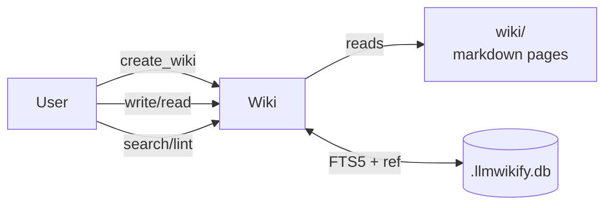
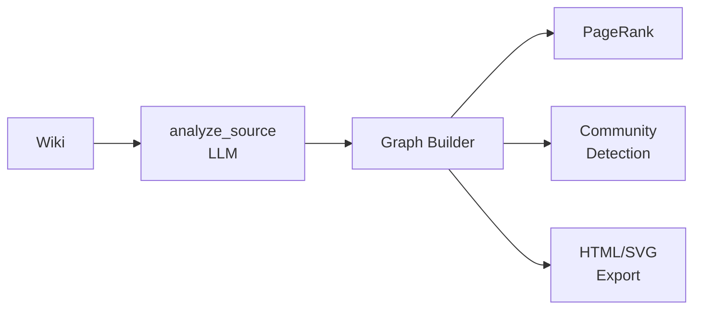
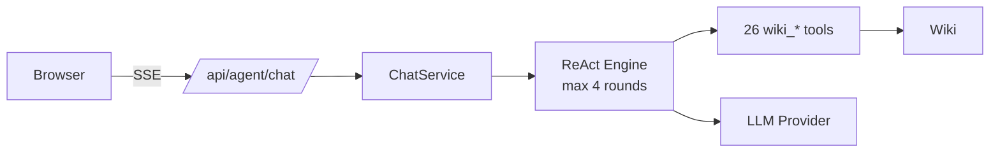

# llmwikify End-to-End Tutorial

> **Auto-generated from test files** — tests are the source of truth.
> **Executable**: `pytest tests/scenarios/ -v` to verify all steps.
> **Version**: v0.38.0 (2026-07-01)

This tutorial is generated from `tests/scenarios/test_*.py`. Each test
step is an executable, verifiable example. The test docstring describes
the *why*; the test code shows the *how*.

## Table of Contents

- [Scenario 1: Wiki Core](#scenario-1-wiki-core)
- [Scenario 2: Knowledge Graph](#scenario-2-knowledge-graph)
- [Scenario 3: Multi-Wiki](#scenario-3-multi-wiki)
- [Scenario 4: Chat + ReAct Agent](#scenario-4-chat-plus-react-agent)
- [Scenario 5: Quant Pipeline](#scenario-5-quant-pipeline)
- [Scenario 6: Lint Rules (Playbook 06)](#scenario-6-lint-rules-(playbook-06))
- [Scenario 7: YAML Templates (Playbook 07)](#scenario-7-yaml-templates-(playbook-07))
- [Scenario 8: Section Anchors (Playbook 08)](#scenario-8-section-anchors-(playbook-08))
- [Scenario 9: Ingest Workflow](#scenario-9-ingest-workflow)
- [Scenario 10: Synthesis Workflow](#scenario-10-synthesis-workflow)
- [Scenario 11: Multi-Wiki Config](#scenario-11-multi-wiki-config)
- [Scenario 12: Quant Full Pipeline](#scenario-12-quant-full-pipeline)
- [Scenario 13: References Detail](#scenario-13-references-detail)
- [Scenario 14: Full Ingest Chain](#scenario-14-full-ingest-chain)

---

## Scenario 1: Wiki Core

### Background

Core wiki operations: initialize a wiki directory, write/read markdown
pages, search via FTS5, build bidirectional link index, run lint.

### Architecture



### Troubleshooting

- Init fails with "already exists": use --overwrite
- Search returns 0: run build_index first
- Lint shows broken links: check [[wikilink]] targets

### Step 1.1: Init Wiki

Step 1.1: Initialize wiki directory structure.

Creates a Wiki instance with raw/ + wiki/ subdirectories.
No LLM required.

**Expected Output:**

```
Wiki root: <temp_dir>/test-wiki
```

### Step 1.2: Write Page

Step 1.2: Write a markdown page and read it back.

Uses wiki.write_page() to create a page, then read_page() to
verify it was stored correctly.

**Code:**

```python
content = '# Test Page\n\nThis is a test page with some content.'
wiki.write_page('test-page', content)
result = wiki.read_page('test-page')
```

### Step 1.3: Write Multiple Pages

Step 1.3: Write multiple pages in a loop.

Demonstrates batch writing pattern for initializing a wiki
with several pages at once.

**Code:**

```python
for (name, content) in sample_pages.items():
    wiki.write_page(name, content)
for name in sample_pages:
    result = wiki.read_page(name)
```

### Step 1.4: Search

Step 1.4: Full-text search via FTS5.

Searches for "Python" across all wiki pages using SQLite FTS5.

**Code:**

```python
for (name, content) in sample_pages.items():
    wiki.write_page(name, content)
results = wiki.search('Python', limit=10)
```

### Step 1.5: Build Index

Step 1.5: Build the bidirectional reference index.

Scans all wiki/*.md files, parses [[wikilink]] syntax, and
populates the page_links table for backlink queries.

**Code:**

```python
for (name, content) in sample_pages.items():
    wiki.write_page(name, content)
idx = wiki.build_index()
```

### Step 1.6: Bidirectional Links

Step 1.6: Query inbound and outbound links.

Demonstrates the bidirectional link system: who links TO a page
(inbound) and what a page links TO (outbound).

**Code:**

```python
wiki.write_page('page-a', '# Page A\n\nLinks to [[page-b]].')
wiki.write_page('page-b', '# Page B\n\nLinked from [[page-a]].')
wiki.build_index()
inbound = wiki.get_inbound_links('page-b')
outbound = wiki.get_outbound_links('page-a')
```

### Step 1.7: Lint

Step 1.7: Run health check via lint().

Returns issues (broken links, orphans) and hints (improvement
suggestions) for the wiki.

**Code:**

```python
for (name, content) in sample_pages.items():
    wiki.write_page(name, content)
result = wiki.lint()
```

### Step 1.8: Status

Step 1.8: Get wiki statistics.

Returns total page count, link count, and other health metrics.

**Code:**

```python
for (name, content) in sample_pages.items():
    wiki.write_page(name, content)
status = wiki.status()
```

## Scenario 2: Knowledge Graph

### Background

Transform a wiki into a knowledge graph: extract entities/relations
from sources via LLM, compute PageRank, detect communities, export
visualization (HTML/SVG/GraphML).

### Architecture



### Troubleshooting

- analyze_source hangs: check LLM config in ~/.llmwikify/llmwikify.json
- graph-analyze OOM on 1000+ pages: use --limit 200
- export-graph blank: install graphviz system package

### Step 2.1: Build Index

Step 2.1: Build the graph index.

Indexes wiki pages for graph analysis (nodes + edges).

**Code:**

```python
wiki.write_page('python', '# Python\n\nA programming language.')
wiki.write_page('ml', '# Machine Learning\n\nUses Python.')
wiki.build_index()
idx = wiki.build_index()
```

### Step 2.2: Analyze Source

Step 2.2: LLM-powered source analysis.

Uses LLM to extract entities, relations, and suggested pages
from a PDF source. Cached in .llmwikify.db.

**Code:**

```python
if not test_pdf.exists():
    pytest.skip('Test PDF not available')
result = wiki.analyze_source(str(test_pdf))
```

### Step 2.3: Suggest Synthesis

Step 2.3: LLM-powered synthesis suggestions.

Compares new sources against existing wiki, suggests cross-source
synthesis pages (e.g., "Compare revenue A vs B").

**Code:**

```python
wiki.write_page('company-a', '# Company A\n\nRevenue: $10B. Growth: 15%.')
wiki.write_page('company-b', '# Company B\n\nRevenue: $8B. Growth: 20%.')
result = wiki.suggest_synthesis()
```

### Step 2.4: Knowledge Gaps Via Cli

Step 2.4: Detect knowledge gaps via CLI.

Identifies outdated pages, missing topics, and redundant content.

**Code:**

```python
wiki.write_page('topic-a', '# Topic A\n\nBasic information about topic A.')
result = subprocess.run(['python3', '-m', 'llmwikify', 'knowledge-gaps'], capture_output=True, text=True, cwd=str(wiki.root))
```

### Step 2.5: Graph Analyze Via Cli

Step 2.5: PageRank + community detection via CLI.

Computes centrality scores and detects communities in the
graph, outputs JSON with stats.

**Code:**

```python
wiki.write_page('page-a', '# A\n\nLinks to [[page-b]] and [[page-c]].')
wiki.write_page('page-b', '# B\n\nLinks to [[page-a]].')
wiki.write_page('page-c', '# C\n\nLinks to [[page-a]].')
wiki.build_index()
result = subprocess.run(['python3', '-m', 'llmwikify', 'graph-analyze', '--json'], capture_output=True, text=True, cwd=str(wiki.root))
```

### Step 2.6: Export Graph Via Cli

Step 2.6: Export graph to interactive HTML.

Generates D3.js force-directed graph for browser viewing.

**Code:**

```python
wiki.write_page('page-a', '# A\n\nLinks to [[page-b]].')
wiki.write_page('page-b', '# B\n\nLinks to [[page-a]].')
wiki.build_index()
output_path = temp_dir / 'graph.html'
result = subprocess.run(['python3', '-m', 'llmwikify', 'export-graph', '--format', 'html', '--output', str(output_path)], capture_output=True, text=True, cwd=str(wiki.root))
```

## Scenario 3: Multi-Wiki

### Background

Manage multiple wikis through a single server using WikiRegistry.
Each wiki can be local (path) or remote (HTTP URL with auth).

### Architecture

```
        ┌────────────────────────┐
        │  llmwikify serve       │
        │  --multi-wiki --web    │
        │  (WikiRegistry)        │
        └─────────┬──────────────┘
                  │
       ┌──────────┼──────────┐
       ▼          ▼          ▼
   ┌──────┐  ┌──────┐  ┌──────────┐
   │wiki-a│  │wiki-b│  │wiki-c    │
   │local │  │local │  │remote    │
   └──────┘  └──────┘  └──────────┘
```

### Troubleshooting

- wikis list shows only default: check discovery.scan_paths
- Remote wiki unreachable: verify URL + API key + server running
- wiki_search_cross returns 0: wiki_ids must match exactly (case-sensitive)

### Step 3.1: Register Wiki

Step 3.1: Register a wiki in the registry.

Creates a wiki at a local path, then registers it in the
WikiRegistry with a unique wiki_id.

**Code:**

```python
from llmwikify import create_wiki
from llmwikify.kernel.multi_wiki.registry import WikiRegistry
wiki_path = temp_dir / 'wiki-a'
create_wiki(wiki_path)
config = {'wikis': {'local': [], 'discovery': {}}}
registry = WikiRegistry(config)
registry.initialize()
instance = registry.register_wiki(wiki_id='wiki-a', name='Wiki A', root=wiki_path)
wikis = registry.list_wikis()
wiki_ids = [w.wiki_id for w in wikis]
```

### Step 3.2: List Wikis

Step 3.2: List all registered wikis.

Returns list of WikiInstance objects with id, name, and root.

**Code:**

```python
from llmwikify import create_wiki
from llmwikify.kernel.multi_wiki.registry import WikiRegistry
wiki_path = temp_dir / 'wiki-b'
create_wiki(wiki_path)
config = {'wikis': {'local': [], 'discovery': {}}}
registry = WikiRegistry(config)
registry.initialize()
registry.register_wiki(wiki_id='wiki-b', name='Wiki B', root=wiki_path)
wikis = registry.list_wikis()
```

### Step 3.3: Switch Wiki

Step 3.3: Switch the default active wiki.

Changes which wiki commands operate on by default.

**Code:**

```python
from llmwikify import create_wiki
from llmwikify.kernel.multi_wiki.registry import WikiRegistry
for name in ['wiki-c1', 'wiki-c2']:
    create_wiki(temp_dir / name)
config = {'wikis': {'local': [], 'discovery': {}}}
registry = WikiRegistry(config)
registry.initialize()
registry.register_wiki(wiki_id='wiki-c1', name='Wiki C1', root=temp_dir / 'wiki-c1')
registry.register_wiki(wiki_id='wiki-c2', name='Wiki C2', root=temp_dir / 'wiki-c2')
registry.set_default_wiki('wiki-c2')
default = registry.get_default_wiki()
```

### Step 3.4: Unregister Wiki

Step 3.4: Unregister a wiki from the registry.

Removes the wiki from the registry but does not delete the
underlying wiki directory.

**Code:**

```python
from llmwikify import create_wiki
from llmwikify.kernel.multi_wiki.registry import WikiRegistry
wiki_path = temp_dir / 'wiki-d'
create_wiki(wiki_path)
config = {'wikis': {'local': [], 'discovery': {}}}
registry = WikiRegistry(config)
registry.initialize()
registry.register_wiki(wiki_id='wiki-d', name='Wiki D', root=wiki_path)
registry.unregister_wiki('wiki-d')
wikis = registry.list_wikis()
```

### Step 3.5: Wiki Discovery

Step 3.5: Auto-discover wikis in a directory.

Scans a directory for existing wiki installations and returns
their paths.

**Code:**

```python
from llmwikify import create_wiki
from llmwikify.kernel.multi_wiki.discovery import WikiDiscovery
for name in ['wiki-e1', 'wiki-e2']:
    create_wiki(temp_dir / name)
discovery = WikiDiscovery()
found = discovery.scan(str(temp_dir))
```

## Scenario 4: Chat + ReAct Agent

### Background

The Chat endpoint uses ReAct loop: LLM decides which wiki tools to
call, executes them, and streams results via SSE. Up to 4 tool-call
rounds per query.

### Architecture



### Troubleshooting

- SSE 401 Unauthorized: add Authorization Bearer token
- tool_call never returns: check LLM config (api_key, base_url)
- save_warning frequent: by design (human-in-loop), set posthoc mode

### Step 4.1: Health Check

Step 4.1: Health check endpoint.

GET /api/health returns {"status": "ok", ...}.

**Code:**

```python
response = client.get('/api/health')
data = response.json()
```

### Step 4.2: Auth Optional

Step 4.2: Authentication is optional by default.

POST /api/agent/chat works without Authorization header
unless --auth-token is configured on the server.

**Code:**

```python
client = httpx.Client(base_url='http://localhost:8765', timeout=10.0)
response = client.post('/api/agent/chat', json={'session_id': 'test', 'message': 'hello'})
```

### Step 4.3: Chat Sse

Step 4.3: Streaming chat via Server-Sent Events.

POST /api/agent/chat with stream returns SSE events:
reasoning → phase → tool_call → stream_end.

**Code:**

```python
headers = {'Authorization': 'Bearer test-token'}
with client.stream('POST', '/api/agent/chat', json={'session_id': 'test', 'message': 'What is Python?'}, headers=headers) as response:
    events = []
    for line in response.iter_lines():
        if line.startswith('data:'):
            events.append(line)
```

### Step 4.4: Chat With Wiki Tool

Step 4.4: Chat can invoke wiki tools.

LLM decides to call wiki_search() to answer a query.

**Code:**

```python
headers = {'Authorization': 'Bearer test-token'}
response = client.post('/api/agent/chat', json={'session_id': 'test', 'message': 'Search for Python in the wiki'}, headers=headers)
```

### Step 4.5: Chat Session List

Step 4.5: List all chat sessions.

GET /api/agent/sessions returns active session metadata.

**Code:**

```python
response = client.get('/api/agent/sessions')
data = response.json()
```

## Scenario 5: Quant Pipeline

### Background

Quant reproduction pipeline: arXiv paper PDF → LLM extracts factors
→ 6-layer Factor YAML → DuckDB storage → backtest → L5 reflection
report.

### Architecture

```
Paper PDF
   │
   │ repro_extract.yaml (LLM prompt)
   ▼
Structured JSON → 6-layer Factor YAML
   │
   │ factor_backtest.py
   ▼
DuckDB (long table)
   │
   │ run_backtest
   ▼
Backtest report (IC / RankIC / quantile)
   │
   │ l5_orchestrator
   ▼
L5 reflection
```

### Troubleshooting

- /api/paper/start 500: check LLM provider config
- Factor L2 SyntaxError: v0.36+ auto-repair via react_engine
- Backtest IC ≈ 0: data source issue, check quantnodes install

### Step 5.1: Quant Init Via Cli

Step 5.1: Initialize quant directory structure.

Creates quant/{factors,papers,factorbacktest,strategies,...}.

**Code:**

```python
import subprocess
result = subprocess.run(['python3', '-m', 'llmwikify', 'quant-init'], capture_output=True, text=True, cwd=str(temp_dir))
```

### Step 5.2: Write Factor

Step 5.2: Write a 6-layer factor YAML file.

Layer 1: logic, Layer 2: computation, Layer 3: financial intuition.

**Code:**

```python
factors_dir = temp_dir / 'quant' / 'factors'
factors_dir.mkdir(parents=True, exist_ok=True)
factor_data = {'name': 'test_momentum', 'asset_type': 'stock', 'category': 'price', 'L1_logic': 'Price momentum over 20 days', 'L2_computation': 'close / close.shift(20) - 1', 'L3_financial': 'Momentum effect in equity markets'}
factor_path = factors_dir / 'stock' / 'price' / 'test_momentum.yaml'
factor_path.parent.mkdir(parents=True, exist_ok=True)
import yaml
factor_path.write_text(yaml.dump(factor_data))
```

### Step 5.3: List Factors

Step 5.3: List factors in the library.

Scans quant/factors/ for all YAML files and returns metadata.

**Code:**

```python
from llmwikify.reproduction.persist.factor_library import list_factors
factors_dir = temp_dir / 'quant' / 'factors'
factors_dir.mkdir(parents=True, exist_ok=True)
factors = list_factors(temp_dir)
```

### Step 5.4: Read Factor

Step 5.4: Read a factor YAML file.

Parses a 6-layer factor YAML and returns the dict.

**Code:**

```python
import yaml
factors_dir = temp_dir / 'quant' / 'factors'
factor_path = factors_dir / 'stock' / 'price' / 'test_read.yaml'
factor_path.parent.mkdir(parents=True, exist_ok=True)
factor_data = {'name': 'test_read', 'L1_logic': 'Test'}
factor_path.write_text(yaml.dump(factor_data))
result = yaml.safe_load(factor_path.read_text())
```

### Step 5.5: Duckdb Schema

Step 5.5: DuckDB factor_values table.

Long table: date × stock × factor_name × value.

**Code:**

```python
import duckdb
db_path = temp_dir / 'factor.duckdb'
conn = duckdb.connect(str(db_path))
conn.execute('\n            CREATE TABLE IF NOT EXISTS factor_values (\n                date DATE,\n                stock VARCHAR,\n                factor_name VARCHAR,\n                value DOUBLE\n            )\n        ')
result = conn.execute("SELECT name FROM sqlite_master WHERE type='table'").fetchall()
table_names = [r[0] for r in result]
conn.close()
```

### Step 5.6: Paper Api

Step 5.6: Paper API endpoint.

GET /api/paper/list returns extracted paper metadata.

**Code:**

```python
import httpx
client = httpx.Client(base_url=server_url, timeout=10.0)
response = client.get('/api/paper/list')
```

### Step 5.7: Factor Library List

Step 5.7: Factor library list via API.

GET /api/factor/library/list returns all factors with metadata.

**Code:**

```python
import httpx
client = httpx.Client(base_url=server_url, timeout=10.0)
response = client.get('/api/factor/library/list')
data = response.json()
```

## Scenario 6: Lint Rules (Playbook 06)

### Background

Demonstrates the 8 lint rule trigger conditions. Constructs redundant
pages, old year references, and content without wikilinks to show
how each rule fires.

### Troubleshooting

- False positive on dated_claim: add context, use "since 2018"
- Lint too noisy: use --brief mode for counts only

### Step 6.1: Dated Claim

Step 6.1: dated_claim rule fires on old year references.

Creates a page with explicit year references; lint flags
content that may be time-sensitive.

**Code:**

```python
wiki.write_page('old-report', '# Report 2018\n\nRevenue: $10B.')
result = wiki.lint()
```

### Step 6.2: Potentially Outdated

Step 6.2: potentially_outdated rule fires on old data refs.

Pages referencing old data sources are flagged for review.

**Code:**

```python
wiki.write_page('outdated', '# Data\n\nFrom 2019 report.')
result = wiki.lint()
```

### Step 6.3: Unsourced Claims

Step 6.3: unsourced_claims rule fires on missing citations.

Pages making claims without [[Source]] or [Source](path) refs
are flagged.

**Code:**

```python
wiki.write_page('claims', '# Claims\n\nMarket grew 15%.')
result = wiki.lint()
```

### Step 6.4: Orphan Page

Step 6.4: orphan_page check (inline in WikiAnalyzer.lint).

Pages with zero inbound links are flagged as orphans.

**Code:**

```python
wiki.write_page('orphan', '# Orphan\n\nNo one links to me.')
result = wiki.lint()
```

### Step 6.5: Brief Mode

Step 6.5: lint --brief returns counts only.

Fast mode for CI pipelines: just total issue count.

**Code:**

```python
wiki.write_page('page', '# Page\n\nSome content.')
result = wiki.lint(mode='brief')
```

## Scenario 7: YAML Templates (Playbook 07)

### Background

4 ready-to-use `.wiki-config.yaml` templates: personal notes (offline),
project docs, academic research (long timeout), industry news
(date archiving). Demonstrates copy + customize + load workflow.

### Troubleshooting

- Template not found: check examples/07_yaml_templates/yaml_templates/
- Config ignored: verify file is at wiki root as .wiki-config.yaml

### Step 7.1: Parse Personal Kb

Step 7.1: Parse personal-kb.yaml template.

Offline personal notes configuration. No LLM required.

**Code:**

```python
import yaml
template_path = Path(__file__).parent.parent.parent / 'examples' / '07_yaml_templates' / 'yaml_templates' / 'personal-kb.yaml'
if not template_path.exists():
    pytest.skip('Template file not found')
template = yaml.safe_load(template_path.read_text())
```

### Step 7.2: Parse Project Docs

Step 7.2: Parse project-docs.yaml template.

Team project documentation with shared wikis.

**Code:**

```python
import yaml
template_path = Path(__file__).parent.parent.parent / 'examples' / '07_yaml_templates' / 'yaml_templates' / 'project-docs.yaml'
if not template_path.exists():
    pytest.skip('Template file not found')
template = yaml.safe_load(template_path.read_text())
```

### Step 7.3: Parse Research Wiki

Step 7.3: Parse research-wiki.yaml template.

Academic research with long LLM timeout for deep analysis.

**Code:**

```python
import yaml
template_path = Path(__file__).parent.parent.parent / 'examples' / '07_yaml_templates' / 'yaml_templates' / 'research-wiki.yaml'
if not template_path.exists():
    pytest.skip('Template file not found')
template = yaml.safe_load(template_path.read_text())
```

### Step 7.4: Parse Mining News

Step 7.4: Parse mining-news-wiki.yaml template.

Industry news with date-based archiving.

**Code:**

```python
import yaml
template_path = Path(__file__).parent.parent.parent / 'examples' / '07_yaml_templates' / 'yaml_templates' / 'mining-news-wiki.yaml'
if not template_path.exists():
    pytest.skip('Template file not found')
template = yaml.safe_load(template_path.read_text())
```

### Step 7.5: Custom Config

Step 7.5: Create wiki with custom config.

Demonstrates create_wiki(path, config={...}) for programmatic
configuration without YAML files.

**Code:**

```python
from llmwikify import create_wiki
config = {'llm': {'provider': 'test', 'model': 'test-model'}, 'orphan_detection': {'exclude_patterns': ['^draft-.*']}}
wiki = create_wiki(temp_dir / 'custom-wiki', config=config)
```

## Scenario 8: Section Anchors (Playbook 08)

### Background

Demonstrates `[[page#section]]` and `[[page#section|display]]` wikilink
syntax, including get_inbound_links / get_outbound_links returning
section fields, include_context=True for surrounding text, and direct
DB queries on page_links table.

### Troubleshooting

- Section not in link data: ensure build_index() was run after writing
- Context empty: include_context=True was not passed

### Step 8.1: Write Target Page

Step 8.1: Write a target page with multiple sections.

The target page must have named sections (## headings) for
section-level linking to work.

**Code:**

```python
wiki.write_page('python-style', '\n# Python Style Guide\n\n## Overview\nPython emphasizes code readability.\n\n## Naming\nUse `snake_case` for functions.\n')
result = wiki.read_page('python-style')
```

### Step 8.2: Write Source Page

Step 8.2: Write a source page with section-level wikilinks.

Uses [[page#section]] syntax to link to a specific section.

**Code:**

```python
wiki.write_page('notes', '# Notes\n\nFollow [[python-style#Naming]] rules.')
result = wiki.read_page('notes')
```

### Step 8.3: Inbound Links

Step 8.3: Get inbound links with section info.

Returns list of links pointing to this page, including which
section is targeted.

**Code:**

```python
wiki.write_page('python-style', '\n# Python Style\n\n## Naming\nUse snake_case.\n')
wiki.write_page('notes', '# Notes\n\nSee [[python-style#Naming]].')
wiki.build_index()
inbound = wiki.get_inbound_links('python-style')
```

### Step 8.4: Outbound Links

Step 8.4: Get outbound links with section info.

Returns list of links FROM this page, including target section.

**Code:**

```python
wiki.write_page('python-style', '\n# Python Style\n\n## Naming\nUse snake_case.\n')
wiki.write_page('notes', '# Notes\n\nSee [[python-style#Naming]].')
wiki.build_index()
outbound = wiki.get_outbound_links('notes')
```

### Step 8.5: Include Context

Step 8.5: Get links with surrounding context.

include_context=True returns the sentence/paragraph around
each link for disambiguation.

**Code:**

```python
wiki.write_page('python-style', '\n# Python Style\n\n## Naming\nUse snake_case.\n')
wiki.write_page('notes', '# Notes\n\nFor variable names, follow [[python-style#Naming]] rules.')
wiki.build_index()
inbound = wiki.get_inbound_links('python-style', include_context=True)
```

## Scenario 9: Ingest Workflow

### Background

Ingest extracts text from files (PDF/MD/HTML), saves to raw/, then
LLM analyzes for entities/relations. batch --self-create combines
both steps for one-shot processing.

### Troubleshooting

- ingest fails on PDF: pip install 'llmwikify[extractors]'
- batch --self-create creates no pages: LLM returned no operations
- analyze_source hangs: check API key in ~/.llmwikify/llmwikify.json

### Step 9.1: Ingest Single File

Step 9.1: Ingest a single markdown file.

Pure text extraction, no LLM. Saves to raw/ for later analysis.

**Code:**

```python
if not sample_markdown_file.exists():
    pytest.skip('Sample markdown file not available')
result = wiki.ingest_source(str(sample_markdown_file))
```

### Step 9.2: Ingest Dry Run

Step 9.2: Ingest with --dry-run flag.

Shows what would happen without actually creating files.

**Code:**

```python
if not sample_markdown_file.exists():
    pytest.skip('Sample markdown file not available')
wiki.root.mkdir(parents=True, exist_ok=True)
dest = wiki.root / 'sample_doc.md'
shutil.copy(sample_markdown_file, dest)
result = subprocess.run(['python3', '-m', 'llmwikify', 'ingest', str(dest), '--dry-run'], capture_output=True, text=True, cwd=str(wiki.root))
```

### Step 9.3: Batch Ingest

Step 9.3: Batch ingest from a directory (no LLM).

Process multiple files at once, extract text only.

**Code:**

```python
if not batch_dir.exists():
    pytest.skip('Batch directory not available')
dest = wiki.root / 'batch_sources'
shutil.copytree(batch_dir, dest, dirs_exist_ok=True)
result = subprocess.run(['python3', '-m', 'llmwikify', 'batch', str(dest)], capture_output=True, text=True, cwd=str(wiki.root))
```

### Step 9.4: Ingest Creates Raw

Step 9.4: Ingest creates raw/ directory structure.

Verifies that raw/ exists after ingest.

**Code:**

```python
if not sample_markdown_file.exists():
    pytest.skip('Sample markdown file not available')
wiki.ingest_source(str(sample_markdown_file))
```

### Step 9.5: Ingest Fts Index

Step 9.5: Ingest updates FTS5 index for search.

Search should find content from ingested files.

**Code:**

```python
if not sample_markdown_file.exists():
    pytest.skip('Sample markdown file not available')
wiki.ingest_source(str(sample_markdown_file))
results = wiki.search('llmwikify', limit=5)
```

### Step 9.6: Analyze Source

Step 9.6: LLM analyzes source for entities/relations.

Two-phase: section metadata (compute) + LLM section selection
+ targeted analysis.

**Code:**

```python
if not sample_markdown_file.exists():
    pytest.skip('Sample markdown file not available')
ingest_result = wiki.ingest_source(str(sample_markdown_file))
source_name = ingest_result.get('source_name')
analysis = wiki.analyze_source(f'raw/{source_name}')
```

### Step 9.7: Batch Self Create

Step 9.7: batch --self-create uses LLM to create pages.

Combines ingest + LLM page creation in one command.

**Code:**

```python
if not batch_dir.exists():
    pytest.skip('Batch directory not available')
dest = wiki.root / 'batch_sources'
shutil.copytree(batch_dir, dest, dirs_exist_ok=True)
result = subprocess.run(['python3', '-m', 'llmwikify', 'batch', str(dest), '--self-create'], capture_output=True, text=True, cwd=str(wiki.root))
```

## Scenario 10: Synthesis Workflow

### Background

Cross-source synthesis: LLM compares multiple sources, suggests
combined wiki pages, identifies knowledge gaps and contradictions.

### Troubleshooting

- suggest_synthesis returns empty: no sources ingested yet
- knowledge-gaps OOM: use --limit 200
- synthesize creates no wikilinks: source_pages names must match stems

### Step 10.1: Suggest Synthesis Multi

Step 10.1: LLM suggests cross-source synthesis pages.

Compares multiple company sources, suggests comparison pages.

**Code:**

```python
wiki.write_page('alibaba-cloud', '# Alibaba Cloud\n\nRevenue: $12B. Growth: 18%.')
wiki.write_page('tencent-cloud', '# Tencent Cloud\n\nRevenue: $8B. Growth: 25%.')
wiki.write_page('huawei-cloud', '# Huawei Cloud\n\nRevenue: $6B. Growth: 30%.')
result = wiki.suggest_synthesis()
```

### Step 10.2: Knowledge Gaps Basic

Step 10.2: Knowledge gaps analysis via lint investigations.

Identifies outdated pages, missing topics, and contradictions.

**Code:**

```python
wiki.write_page('topic-a', '# Topic A\n\nBasic information about topic A.')
wiki.write_page('topic-b', '# Topic B\n\nLinks to [[topic-a]] and [[nonexistent]].')
result = wiki.lint(generate_investigations=True)
```

### Step 10.3: Knowledge Gaps Cli

Step 10.3: Knowledge gaps via CLI command.

Human-readable report of outdated, missing, and redundant content.

**Code:**

```python
wiki.write_page('outdated-page', '# Data 2019\n\nRevenue: $5B from 2019 report.')
result = subprocess.run(['python3', '-m', 'llmwikify', 'knowledge-gaps', '--json'], capture_output=True, text=True, cwd=str(wiki.root))
```

### Step 10.4: Graph Pagerank

Step 10.4: Graph analysis with PageRank ranking.

Identifies most central pages by link topology.

**Code:**

```python
wiki.write_page('hub', '# Hub\n\nLinks to [[spoke-a]], [[spoke-b]], [[spoke-c]].')
wiki.write_page('spoke-a', '# Spoke A\n\nLinks to [[hub]].')
wiki.write_page('spoke-b', '# Spoke B\n\nLinks to [[hub]].')
wiki.write_page('spoke-c', '# Spoke C\n\nLinks to [[hub]].')
wiki.build_index()
result = subprocess.run(['python3', '-m', 'llmwikify', 'graph-analyze', '--json'], capture_output=True, text=True, cwd=str(wiki.root))
import json
output = json.loads(result.stdout)
```

### Step 10.5: Export Graph Formats

Step 10.5: Export graph in HTML format.

Interactive D3.js graph for browser viewing.

**Code:**

```python
wiki.write_page('page-a', '# A\n\nLinks to [[page-b]].')
wiki.write_page('page-b', '# B\n\nLinks to [[page-a]].')
wiki.build_index()
html_path = temp_dir / 'graph.html'
result_html = subprocess.run(['python3', '-m', 'llmwikify', 'export-graph', '--format', 'html', '--output', str(html_path)], capture_output=True, text=True, cwd=str(wiki.root))
```

## Scenario 11: Multi-Wiki Config

### Background

Multi-wiki collaboration via .wiki-config.yaml. Each wiki can be
local (path) or remote (HTTP URL). Discovery scans directories for
existing wiki installations.

### Troubleshooting

- Config not loaded: file must be at wiki root as .wiki-config.yaml
- Discovery finds nothing: check scan_paths relative to wiki root

### Step 11.1: Config Parse Wikis

Step 11.1: Parse .wiki-config.yaml with wikis section.

Validates YAML structure of multi-wiki config.

**Code:**

```python
config = {'wikis': {'default': 'personal', 'local': [{'id': 'personal', 'name': 'Personal Wiki', 'path': '.'}, {'id': 'team', 'name': 'Team Wiki', 'path': '../team'}]}}
config_path = temp_dir / '.wiki-config.yaml'
config_path.write_text(yaml.dump(config))
loaded = yaml.safe_load(config_path.read_text())
```

### Step 11.2: Config Local Wikis

Step 11.2: Register local wikis from config.

Creates wikis at the configured paths and registers them.

**Code:**

```python
from llmwikify import create_wiki
from llmwikify.kernel.multi_wiki.registry import WikiRegistry
for name in ['personal', 'team', 'cloud']:
    create_wiki(temp_dir / name)
config = {'wikis': {'default': 'personal', 'local': [{'id': 'personal', 'name': 'Personal', 'path': str(temp_dir / 'personal')}, {'id': 'team', 'name': 'Team', 'path': str(temp_dir / 'team')}, {'id': 'cloud', 'name': 'Cloud', 'path': str(temp_dir / 'cloud')}], 'discovery': {}}}
registry = WikiRegistry(config)
registry.initialize()
for wiki_config in config['wikis']['local']:
    registry.register_wiki(wiki_id=wiki_config['id'], name=wiki_config['name'], root=Path(wiki_config['path']))
wikis = registry.list_wikis()
wiki_ids = [w.wiki_id for w in wikis]
```

### Step 11.3: Config Discovery

Step 11.3: Parse discovery section in config.

Auto-discovery scans scan_paths for existing wiki installations.

**Code:**

```python
config = {'wikis': {'default': 'personal', 'local': [], 'discovery': {'enabled': True, 'scan_paths': [str(temp_dir)], 'scan_depth': 2}}}
```

### Step 11.4: Search Cross Wiki

Step 11.4: Cross-wiki search with multiple wikis.

Searches across all registered wikis for matching content.

**Code:**

```python
from llmwikify import create_wiki
from llmwikify.kernel.multi_wiki.registry import WikiRegistry
for name in ['wiki-a', 'wiki-b']:
    w = create_wiki(temp_dir / name)
    w.write_page('common-topic', f'# Common Topic\n\nContent from {name}.')
config = {'wikis': {'local': [], 'discovery': {}}}
registry = WikiRegistry(config)
registry.initialize()
for name in ['wiki-a', 'wiki-b']:
    registry.register_wiki(wiki_id=name, name=name, root=temp_dir / name)
wikis = registry.list_wikis()
```

## Scenario 12: Quant Full Pipeline

### Background

Full quant reproduction pipeline: paper extraction → factor YAML →
DuckDB storage → backtest execution → L5 reflection report.

### Troubleshooting

- paper/start 500: check LLM provider config
- Factor L2 SyntaxError: v0.36+ auto-repair via react_engine
- Backtest IC ≈ 0: data source issue

### Step 12.1: Quant Init Creates Structure

Step 12.1: Quant-init creates expected directory structure.

Creates quant/{factors,papers,factorbacktest,strategies,...}.

**Code:**

```python
result = subprocess.run(['python3', '-m', 'llmwikify', 'quant-init'], capture_output=True, text=True, cwd=str(temp_dir))
quant_dir = temp_dir / 'quant'
if result.returncode == 0:
```

### Step 12.2: Factor Write And Read

Step 12.2: Write and read a 6-layer factor YAML.

Layer 1 logic, Layer 2 computation, Layer 3 financial,
Layer 4 hypothesis.

**Code:**

```python
import yaml
factors_dir = temp_dir / 'quant' / 'factors'
factor_path = factors_dir / 'stock' / 'price' / 'momentum_20d.yaml'
factor_path.parent.mkdir(parents=True, exist_ok=True)
factor_data = {'name': 'momentum_20d', 'asset_type': 'stock', 'category': 'price', 'L1_logic': 'Price momentum over 20 days', 'L2_computation': 'close / close.shift(20) - 1', 'L3_financial': 'Momentum effect in equity markets', 'L4_hypothesis': 'Stocks with strong recent momentum continue to outperform'}
factor_path.write_text(yaml.dump(factor_data))
loaded = yaml.safe_load(factor_path.read_text())
```

### Step 12.3: Factor Library List

Step 12.3: List factors in the library.

Scans quant/factors/ recursively.

**Code:**

```python
import yaml
from llmwikify.reproduction.persist.factor_library import list_factors
factors_dir = temp_dir / 'quant' / 'factors' / 'stock' / 'price'
factors_dir.mkdir(parents=True, exist_ok=True)
factor_data = {'name': 'test_factor', 'L1_logic': 'Test'}
(factors_dir / 'test_factor.yaml').write_text(yaml.dump(factor_data))
factors = list_factors(temp_dir)
```

### Step 12.4: Duckdb Factor Values

Step 12.4: DuckDB factor_values table.

Long table schema: date × stock × factor_name × value.

**Code:**

```python
import duckdb
db_path = temp_dir / 'factor.duckdb'
conn = duckdb.connect(str(db_path))
conn.execute('\n            CREATE TABLE IF NOT EXISTS factor_values (\n                date DATE,\n                stock VARCHAR,\n                factor_name VARCHAR,\n                value DOUBLE\n            )\n        ')
conn.execute("\n            INSERT INTO factor_values VALUES\n            ('2024-01-01', 'AAPL', 'momentum_20d', 0.05),\n            ('2024-01-01', 'GOOGL', 'momentum_20d', 0.03)\n        ")
result = conn.execute('SELECT COUNT(*) FROM factor_values').fetchone()
conn.close()
```

### Step 12.5: Paper Api Endpoint

Step 12.5: Paper API endpoint.

GET /api/paper/list returns extracted papers.

**Code:**

```python
import httpx
client = httpx.Client(base_url=server_url, timeout=10.0)
response = client.get('/api/paper/list')
```

## Scenario 13: References Detail

### Background

Detailed reference queries: inbound/outbound link counts, --detail
mode for full link metadata, section-level references with
[[page#section]] syntax.

### Troubleshooting

- Links not in result: ensure build_index() was run
- Detail mode shows nothing: wiki has no pages yet

### Step 13.1: References Inbound Outbound

Step 13.1: Get inbound and outbound references.

Demonstrates the bidirectional link query API.

**Code:**

```python
wiki.write_page('source', '# Source\n\nLinks to [[target]].')
wiki.write_page('target', '# Target\n\nLinked from [[source]].')
wiki.write_page('other', '# Other\n\nAlso links to [[target]].')
wiki.build_index()
inbound = wiki.get_inbound_links('target')
outbound = wiki.get_outbound_links('source')
```

### Step 13.2: References Detail Mode

Step 13.2: References with --detail mode via CLI.

Returns full link metadata: source, target, section, line.

**Code:**

```python
wiki.write_page('page-a', '# A\n\nLinks to [[page-b]] and [[page-c]].')
wiki.write_page('page-b', '# B\n\nLinks to [[page-a]].')
wiki.write_page('page-c', '# C\n\nLinks to [[page-a]].')
wiki.build_index()
result = subprocess.run(['python3', '-m', 'llmwikify', 'references', 'page-a', '--detail'], capture_output=True, text=True, cwd=str(wiki.root))
```

### Step 13.3: References Section Links

Step 13.3: Section-level references with [[page#section]].

Outbound links include section info.

**Code:**

```python
wiki.write_page('guide', '# Guide\n\n## Overview\nOverview content.\n\n## Setup\nSetup content.')
wiki.write_page('notes', '# Notes\n\nSee [[guide#Setup]] for setup instructions.')
wiki.build_index()
outbound = wiki.get_outbound_links('notes')
if outbound:
    link = outbound[0]
```

## Scenario 14: Full Ingest Chain

### Background

End-to-end ingest chain: extract text → analyze with LLM → batch
create pages → suggest synthesis → synthesize → verify via search
and lint.

### Troubleshooting

- Chain breaks at analyze: check LLM config
- Chain breaks at batch: source must be ingested first
- Chain breaks at synthesize: source_pages must be valid page stems

### Step 14.1: Ingest Extract

Step 14.1: Ingest extracts text, saves to raw/.

First step in the chain. Pure text extraction, no LLM.

**Code:**

```python
if not sample_markdown_file.exists():
    pytest.skip('Sample markdown file not available')
result = wiki.ingest_source(str(sample_markdown_file))
```

### Step 14.2: Analyze Source

Step 14.2: analyze-source uses LLM to extract entities/relations.

Second step. LLM processes extracted text.

**Code:**

```python
if not sample_markdown_file.exists():
    pytest.skip('Sample markdown file not available')
ingest_result = wiki.ingest_source(str(sample_markdown_file))
source_name = ingest_result.get('source_name')
analysis = wiki.analyze_source(f'raw/{source_name}')
```

### Step 14.3: Batch Self Create

Step 14.3: batch --self-create uses LLM to create pages.

Combines ingest + LLM page creation.

**Code:**

```python
if not batch_dir.exists():
    pytest.skip('Batch directory not available')
dest = wiki.root / 'batch_sources'
shutil.copytree(batch_dir, dest, dirs_exist_ok=True)
result = subprocess.run(['python3', '-m', 'llmwikify', 'batch', str(dest), '--self-create'], capture_output=True, text=True, cwd=str(wiki.root))
```

### Step 14.4: Suggest Synthesis

Step 14.4: suggest-synthesis generates recommendations.

LLM suggests cross-source synthesis pages.

**Code:**

```python
wiki.write_page('source-a', '# Company A\n\nRevenue: $10B. Growth: 15%.')
wiki.write_page('source-b', '# Company B\n\nRevenue: $8B. Growth: 20%.')
result = wiki.suggest_synthesis()
```

### Step 14.5: Synthesize Query

Step 14.5: synthesize creates wiki page from query answer.

Writes a new page to wiki/synthesis/ with auto-linking.

**Code:**

```python
wiki.write_page('company-a', '# Company A\n\nRevenue: $10B.')
wiki.write_page('company-b', '# Company B\n\nRevenue: $8B.')
result = wiki.synthesize_query(query='Compare revenue', answer='# Revenue Comparison\n\nA: $10B, B: $8B.', source_pages=['company-a', 'company-b'], auto_link=True)
page = wiki.read_page(result['page_name'])
```

### Step 14.6: Full Chain

Complete ingest chain: ingest → analyze → write → search → lint.

End-to-end verification of the entire pipeline.

**Code:**

```python
if not sample_markdown_file.exists():
    pytest.skip('Sample markdown file not available')
ingest_result = wiki.ingest_source(str(sample_markdown_file))
source_name = ingest_result.get('source_name')
analysis = wiki.analyze_source(f'raw/{source_name}')
wiki.write_page('analysis-result', '# Analysis\n\nFrom ingested content.')
idx = wiki.build_index()
results = wiki.search('analysis', limit=5)
lint_result = wiki.lint()
```

---

## Appendix A: TUTORIAL.md Concepts

Cross-references to detailed concepts:

- **Prerequisites**: Python 3.10+, `pip install 'llmwikify[extractors,web]'`, optional LLM key
- **Configuration Priority**: see [TUTORIAL.md](TUTORIAL.md) Appendix A
- **CLI vs Python API**: see [TUTORIAL.md](TUTORIAL.md) Appendix B
- **MCP Client Integration**: see [TUTORIAL.md](TUTORIAL.md) Appendix C

## Appendix B: How to Use This Tutorial

1. **Read the Background** of each scenario to understand the use case
2. **Review the Architecture** diagram to see data flow
3. **Execute the steps** via `pytest tests/scenarios/ -v`
4. **Check Troubleshooting** if a step fails

## Appendix C: Companion Playbooks

Runnable examples in [`examples/01_~08_`](../examples/README.md):

- 01: Personal Reading Notes
- 02: Company Research KB
- 03: Multi-Wiki Registry
- 04: Chat SSE Client
- 05: Paper to Factor
- 06: Lint 8 Rules
- 07: YAML Templates
- 08: Section Anchor Tracking
